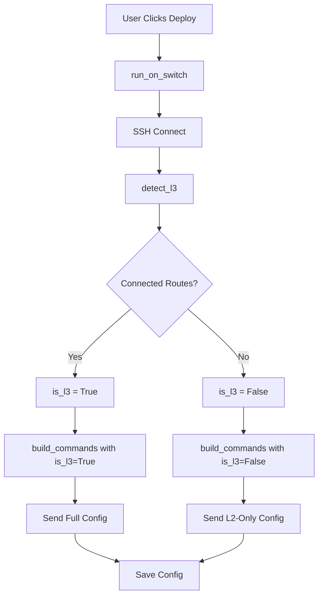

## Overview

SECURE-BRANCH-lac automatically detects whether a switch operates at **Layer 2** (switching only) or **Layer 3** (switching + routing) and adapts its configuration accordingly. This detection happens at runtime via SSH before deploying any configuration.

## Why Detection Matters

### Layer 2 Switches (IOSvL2 without ip routing)

- **Cannot route between VLANs** — Inter-VLAN routing must be done by an external router (router-on-a-stick)
- **Cannot run DHCP server** — DHCP relay forwards requests to an external DHCP server
- **Cannot have IP addresses on SVIs** — Except for management (VLAN 1)
- **Do not support `ip routing` command** — Attempting to enable it will cause errors

### Layer 3 Switches (IOSvL2 with ip routing)

- **Can route between VLANs** — SVIs act as default gateways for each VLAN
- **Can run DHCP server** — Directly serve IP addresses to clients
- **Have IP addresses on SVIs** — One IP per VLAN for inter-VLAN routing
- **Support static routes and OSPF** — Full routing protocol support

<Warning>
  If the app tries to configure Layer 3 features (SVIs with IP, DHCP pools, routing) on a Layer 2-only switch, the configuration will **fail** and may require manual recovery. Automatic detection prevents this.
</Warning>

## Detection Strategy

### Algorithm

The detection is performed by the `detect_l3()` function in `connector.py`:

```python
# source/core/connector.py:50-69
def detect_l3(nc) -> bool:
    """
    Detecta si el switch tiene ip routing activo (Layer 3) o no (Layer 2).

    Estrategia: ejecuta 'show ip route connected' y busca líneas que comiencen
    con 'C' (ruta directamente conectada). Si las hay, el switch enruta.

    Parámetros
    ----------
    nc : Conexión Netmiko activa (en modo enable).

    Retorna
    -------
    bool : True = Layer 3 (ip routing activo), False = Layer 2.
    """
    try:
        out = nc.send_command("show ip route connected", delay_factor=2)
        return bool(re.search(r'^C\s+', out, re.MULTILINE))
    except Exception:
        return False   # Si falla, asumimos L2 por seguridad
```

### Detection Flow

<Steps>
  <Step title="SSH Connection">
    Connect to switch via Netmiko using credentials from `sucursales` state
  </Step>
  
  <Step title="Execute Command">
    Run `show ip route connected` in privileged EXEC mode
  </Step>
  
  <Step title="Parse Output">
    Search for lines starting with `C` (Connected routes)
    
    ```
    C    192.168.10.0/24 is directly connected, Vlan10
    C    192.168.20.0/24 is directly connected, Vlan20
    ```
  </Step>
  
  <Step title="Return Result">
    - **True** if connected routes found → Layer 3 switch
    - **False** if no connected routes → Layer 2 switch
    - **False** if command fails (safe default)
  </Step>
</Steps>

### When Detection Occurs

Detection happens at multiple points:

1. **Connection Testing** (Tab ① — Sucursales)
   ```python
   # source/core/connector.py:241-271
   def test_connection(sw: dict):
       nc = ConnectHandler(**make_device_params(sw))
       nc.enable()
       is_l3 = detect_l3(nc)  # ← Detection here
       return {'hostname': ..., 'is_l3': is_l3, 'ver_out': ...}
   ```

2. **Configuration Deployment** (Tab ⑥ — Ejecución)
   ```python
   # source/core/connector.py:157-164
   def run_on_switch(sw: dict, config_params: dict, ...):
       nc = ConnectHandler(**make_device_params(sw))
       nc.enable()
       is_l3 = detect_l3(nc)  # ← Detection here
       layer = "Layer 3" if is_l3 else "Layer 2"
       log_fn(f"  ✔ Conectado: '{hostname}'  |  {layer}")
   ```

## Configuration Differences

### Layer 2 Configuration (is_l3 = False)

<Accordion title="1. IP Routing — OMITTED">
```python
# source/core/command_builder.py:108-113
if chk_intervlan and is_l3:
    cmds += ["ip routing", "service dhcp"]
elif not is_l3 and log_fn:
    log_fn("  [INFO] Switch L2 detectado → se omite 'ip routing' y SVIs con IP")
```

**Result:** No routing commands sent to Layer 2 switches
</Accordion>

<Accordion title="2. DHCP Pools — OMITTED">
```python
# source/core/command_builder.py:115-127
if is_l3:
    for pool in dhcp_pools:
        cmds.append(f"ip dhcp excluded-address {pool['gw']}")
        cmds += [
            f"ip dhcp pool {pool['name']}",
            f"network {pool['net']} {pool['mask']}",
            f"default-router {pool['gw']}",
            "dns-server 8.8.8.8",
            "exit"
        ]
```

**Result:** DHCP must be configured on external router (R1)
</Accordion>

<Accordion title="3. SVIs with IP — OMITTED">
```python
# source/core/command_builder.py:188-207
if is_l3:
    for v in vlans_data:
        if svi_ip or needs_acl:
            cmds.append(f"interface vlan {v['id']}")
            if svi_ip:
                cmds += [f"ip address {svi_ip} {svi_mask}", "no shutdown"]
            if needs_acl:
                cmds.append(f"ip access-group {acl_name} in")
            cmds.append("exit")
```

**Result:** SVIs created without IP addresses on Layer 2 switches

**Note:** ACLs can still be applied to SVIs even on Layer 2 switches for local filtering
</Accordion>

<Accordion title="4. VLANs — ALWAYS CONFIGURED">
```python
# source/core/command_builder.py:129-167
for v in vlans_data:
    cmds.append(f"vlan {v['id']}")
    if v['name']:
        cmds.append(f"name {v['name']}")
    cmds.append("exit")
    
    # Port assignment works on both L2 and L3
    if v['assign_ports'] and v['ports']:
        ports_norm = expand_ports(v['ports'])
        # ... configure access/trunk mode
```

**Result:** VLAN creation and port assignment identical for both layers
</Accordion>

### Layer 3 Configuration (is_l3 = True)

<Accordion title="Full Feature Set Enabled">
- **IP Routing:** `ip routing` and `service dhcp`
- **DHCP Pools:** Full DHCP server configuration with exclusions
- **SVIs with IP:** Each VLAN gets a gateway IP on the switch
- **Static Routes:** Inter-subnet routing via `ip route`
- **OSPF:** Dynamic routing protocol for route advertisement
- **ACLs on SVIs:** Traffic filtering at Layer 3
- **QoS:** All QoS features (priority queuing, policing, shaping)
- **GRE over IPsec:** Encrypted tunnels between sites
</Accordion>

## Example Output Comparison

### Layer 2 Switch Log

```
────────────────────────────────────────────────────────
  Sucursal: SW-L2-BRANCH  |  192.168.1.101
────────────────────────────────────────────────────────
  ✔ Conectado: 'SW-L2-BRANCH'  |  Layer 2
  [INFO] Switch L2 detectado → se omite 'ip routing' y SVIs con IP
  [Config] Enviando 45 comandos...
  [1/45] vlan 10
  [2/45] name VENTAS
  [3/45] exit
  [4/45] interface range GigabitEthernet0/1-5
  [5/45] switchport mode access
  [6/45] switchport access vlan 10
  ...
  ✔ SW-L2-BRANCH — GUARDADO EXITOSAMENTE
```

**Key Points:**
- Detected as Layer 2
- Informational message about skipping routing/SVIs
- Only VLANs and port assignments configured
- No DHCP, no SVI IPs, no routing

### Layer 3 Switch Log

```
────────────────────────────────────────────────────────
  Sucursal: SW-L3-CORE  |  192.168.1.1
────────────────────────────────────────────────────────
  ✔ Conectado: 'SW-L3-CORE'  |  Layer 3
  [Config] Enviando 127 comandos...
  [1/127] ip routing
  [2/127] service dhcp
  [3/127] ip dhcp excluded-address 192.168.10.1
  [4/127] ip dhcp pool POOL_VENTAS
  [5/127] network 192.168.10.0 255.255.255.0
  [6/127] default-router 192.168.10.1
  ...
  [35/127] interface vlan 10
  [36/127] ip address 192.168.10.1 255.255.255.0
  [37/127] no shutdown
  ...
  [89/127] ip route 0.0.0.0 0.0.0.0 192.168.1.254
  [90/127] router ospf 1
  [91/127] network 192.168.10.0 0.0.0.255 area 0
  ...
  ✔ SW-L3-CORE — GUARDADO EXITOSAMENTE
```

**Key Points:**
- Detected as Layer 3
- Full routing configuration applied
- DHCP pools created
- SVIs configured with IP addresses
- Static routes and OSPF configured

## Detection in Code Flow

### Execution Path



### State Storage

The last detection result is stored in application state:

```python
# source/app.py:84
self.detected_l3 = None  # True=L3 / False=L2 / None=no detectado aún
```

This allows the UI to show detection results without re-testing:

```python
# Example: Display in status bar
if app.detected_l3 is None:
    status = "No detectado"
elif app.detected_l3:
    status = "Layer 3 (Routing activo)"
else:
    status = "Layer 2 (Solo switching)"
```

## Protected Resources Regardless of Layer

Some resources are **never modified** on either Layer 2 or Layer 3 switches:

<CardGroup cols={2}>
  <Card title="Uplink Interface" icon="ethernet">
    `GigabitEthernet0/0` — Management uplink
    
    Defined in `constants.py:UPLINK_IFACE`
  </Card>
  
  <Card title="SSH Configuration" icon="key">
    VTY lines, crypto keys, SSH settings
    
    Required for remote management
  </Card>
  
  <Card title="VLAN 1" icon="network-wired">
    Native management VLAN
    
    Never deleted or modified
  </Card>
  
  <Card title="Pre-existing Routes" icon="route">
    Routes not configured by this app
    
    Protected during cleanup
  </Card>
</CardGroup>

```python
# source/core/command_builder.py:294-298
"""
Protege:
  - SSH, usuarios, VTY, crypto key (acceso remoto)
  - Interfaz de uplink (UPLINK_IFACE)
  - Rutas estáticas y redes OSPF que NO fueron configuradas por esta app
  - VLAN 1 (nativa, no se borra)
"""
```

## Error Handling

### Detection Failure

If `show ip route connected` fails (e.g., insufficient privileges, command not supported):

```python
# source/core/connector.py:65-69
try:
    out = nc.send_command("show ip route connected", delay_factor=2)
    return bool(re.search(r'^C\s+', out, re.MULTILINE))
except Exception:
    return False   # Si falla, asumimos L2 por seguridad
```

**Safe Default:** Assume Layer 2 to avoid sending Layer 3 commands that might fail

### Configuration Mismatch

If user enables "Activar ip routing" checkbox but switch is Layer 2:

```python
# source/core/command_builder.py:110-113
if chk_intervlan and is_l3:
    cmds += ["ip routing", "service dhcp"]
elif not is_l3 and log_fn:
    log_fn("  [INFO] Switch L2 detectado → se omite 'ip routing' y SVIs con IP")
```

**Result:** Checkbox is ignored, log message informs user of the skip

## Testing Layer Detection

### Manual Verification

<Steps>
  <Step title="Connect to Switch">
    Use SSH client to connect to the switch
    
    ```bash
    ssh cisco@192.168.1.101
    ```
  </Step>
  
  <Step title="Enter Enable Mode">
    ```
    Switch> enable
    Switch#
    ```
  </Step>
  
  <Step title="Check Routing">
    ```
    Switch# show ip route connected
    ```
    
    **Layer 3 Output:**
    ```
    C    192.168.10.0/24 is directly connected, Vlan10
    C    192.168.20.0/24 is directly connected, Vlan20
    ```
    
    **Layer 2 Output:**
    ```
    % IP routing table is empty
    ```
    or
    ```
    % IP routing not enabled
    ```
  </Step>
  
  <Step title="Alternative Check">
    ```
    Switch# show running-config | include ip routing
    ```
    
    **Layer 3:** `ip routing` present in config
    
    **Layer 2:** No output (command not configured)
  </Step>
</Steps>

### Automated Testing in App

Use the "Probar" button in Tab ① (Sucursales):

1. Select a switch from the list
2. Click **Probar** button
3. Connection test runs `test_connection()` which calls `detect_l3()`
4. Result displayed in popup:
   ```
   Conectado exitosamente a 'SW-BRANCH-01'
   Tipo: Layer 3
   IOS: vios_l2-ADVENTERPRISEK9-M 15.2
   ```

## Best Practices

<AccordionGroup>
  <Accordion title="Always Test Before Deploy">
    Use the connection test feature (Tab ①) before deploying configuration to verify:
    - Credentials are correct
    - Switch is reachable
    - Layer type is correctly detected
  </Accordion>
  
  <Accordion title="Understand Your Topology">
    Know whether your switches should be Layer 2 or Layer 3:
    - **Access switches** (edge) → Usually Layer 2
    - **Distribution/Core switches** → Usually Layer 3
    - **Router-on-a-stick** topology → Switches are Layer 2, router handles inter-VLAN
  </Accordion>
  
  <Accordion title="Monitor Detection Logs">
    Review logs during deployment to confirm correct detection:
    ```
    ✔ Conectado: 'SW-BRANCH'  |  Layer 2
    [INFO] Switch L2 detectado → se omite 'ip routing' y SVIs con IP
    ```
  </Accordion>
  
  <Accordion title="Verify Post-Deployment">
    After configuration, verify on the switch:
    ```bash
    # Layer 3 verification
    show ip interface brief | include Vlan
    show ip route
    show ip dhcp pool
    
    # Layer 2 verification
    show vlan brief
    show interfaces status
    ```
  </Accordion>
</AccordionGroup>

## Troubleshooting

### Problem: Switch detected as Layer 2 but should be Layer 3

**Cause:** `ip routing` was disabled or never configured

**Solution:**
```bash
Switch# configure terminal
Switch(config)# ip routing
Switch(config)# end
Switch# write memory
```

Then re-test connection in the app.

### Problem: Switch detected as Layer 3 but only has Layer 2 license

**Cause:** Some IOS images have `ip routing` enabled by default even without full Layer 3 support

**Solution:** Verify switch capabilities:
```bash
Switch# show version | include License
Switch# show license feature
```

If Layer 3 features are restricted, configure the switch as Layer 2 (disable `ip routing`).

### Problem: Detection fails with timeout

**Cause:** Network latency or switch CPU overload

**Solution:** Check `delay_factor` in connector.py:
```python
# source/core/connector.py:66
out = nc.send_command("show ip route connected", delay_factor=2)
```

Increase to `delay_factor=4` if switches are slow to respond.

## Summary

<Check>
  **Automatic Detection:** Switch layer type detected at connection time via `show ip route connected`
</Check>

<Check>
  **Adaptive Configuration:** Layer 3 features (routing, DHCP, SVI IPs) only sent to Layer 3 switches
</Check>

<Check>
  **Safe Defaults:** Detection failure assumes Layer 2 to prevent configuration errors
</Check>

<Check>
  **No Manual Configuration:** Users don't need to specify switch type; app detects automatically
</Check>

<Check>
  **Protected Resources:** Critical infrastructure (SSH, uplink, VLAN 1) never modified regardless of layer
</Check>

## Next Steps

<CardGroup cols={2}>
  <Card title="Architecture Overview" icon="diagram-project" href="/architecture/overview">
    High-level design and architectural principles
  </Card>
  
  <Card title="Project Structure" icon="folder-tree" href="/architecture/project-structure">
    Detailed file structure and module responsibilities
  </Card>
</CardGroup>